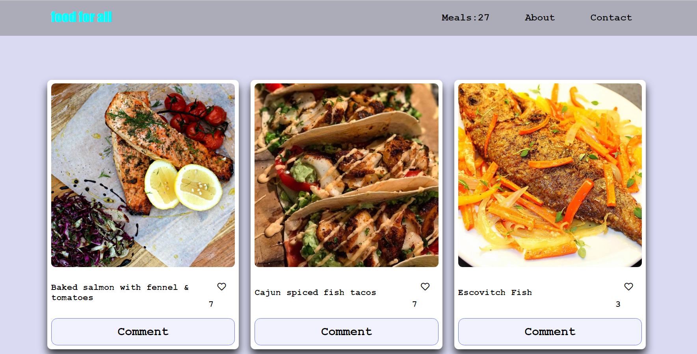

# RestaurantApp

> This website App displays meals information from Sea food. It also allows users to submit their comments and likes for their favorite dish. All data is preserved thanks to the external MealsDB API, and involvement API

## Built With
- Javascript
- Html
- Css
- Jest
- Webpack
- Fontawesome CDN

## Live demo
[LiveLink](https://olipliche.github.io/JS-Capstone/dist/)

### Video demo
[VideoLink](https://www.loom.com/share/47d74ed9c139450bbdba457a1cbf00d0)

## Getting Started
To get a local copy of this project, follow these simple steps:
- Clone this clone this repo by typing: `git clone https://github.com/OLIPLICHE/JS-Capstone.git`.git`, on your local terminal
- Run `cd <name of the folder>` to access the project folder

## To make the project run in your local machine
- You will need to set up or install webpack in your machine. Open the link bellow for set up
- `https://webpack.js.org/guides/getting-started/#basic-setup`

## Installation of Packages.Json
 Run the code bellow inside your terminal to install Packages.Json in your local machine.
- npm install --save-dev stylelint stylelint-config-standard
- {
  "extends": "stylelint-config-standard"
}
- npx stylelint "**/*.css"

### Prerequisites
- Text editor
- Git
- Html
- CSS
- Js
- webpack

## Authors

👤 **Olipliche Mavoungou Paka**  
- GitHub: [@OLIPLICHE](https://github.com/OLIPLICHE)
- Twitter: [@olipliche1](https://twitter.com/paka)
- LinkedIn: [LinkedIn](https://www.linkedin.com/in/olipliche-paka-mavoungou/)

👤 **Emmanuel Obonyo**
- GitHub: [@emmyobonyo](https://github.com/emmyobonyo)
- Twitter: [@emmyobonyo](https://twitter.com/emmyobonyo)
- LinkedIn: [LinkedIn](https://www.linkedin.com/in/emmanuel-obonyo-3728a2200/)

## 🤝 Contributing

Contributions, issues and feature requests are welcome!

Feel free to check the [issues page]().

## Show your support

Give a ⭐️ if you like this project!

## Acknowledgments

- Hat tip to anyone whose code was used
- Inspiration
- etc

## 📝 License

This project is [MIT](./MIT.md) licensed.